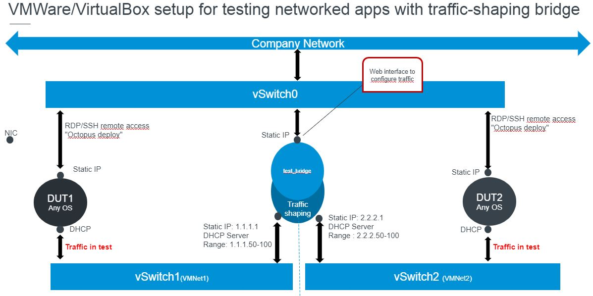

Needed software:
- I've used a Ubuntu deriviate [Bodhi Linux](https://www.bodhilinux.com/)
- tcGui project: https://github.com/tum-lkn/tcgui.git
- remove packages: nplan netplan netplant.io 
- install deb-packages: ifupdown iproute2 dnsmasq python3 python3-flask 

Enable IP4 forwarding temporarily
- sudo sysctl -w net.ipv4.ip_forward=1
- Or sudo echo 1 > /proc/sys/net/ipv4/ip_forward

Enable IP4 forwarding permanently
- Edit /etc/sysctl.conf with your favorite editor
- Find the line starting with "#net.ipv4.ip_forward=1"
- Uncomment the line by removing the first character "#"
- Exit & save the file
